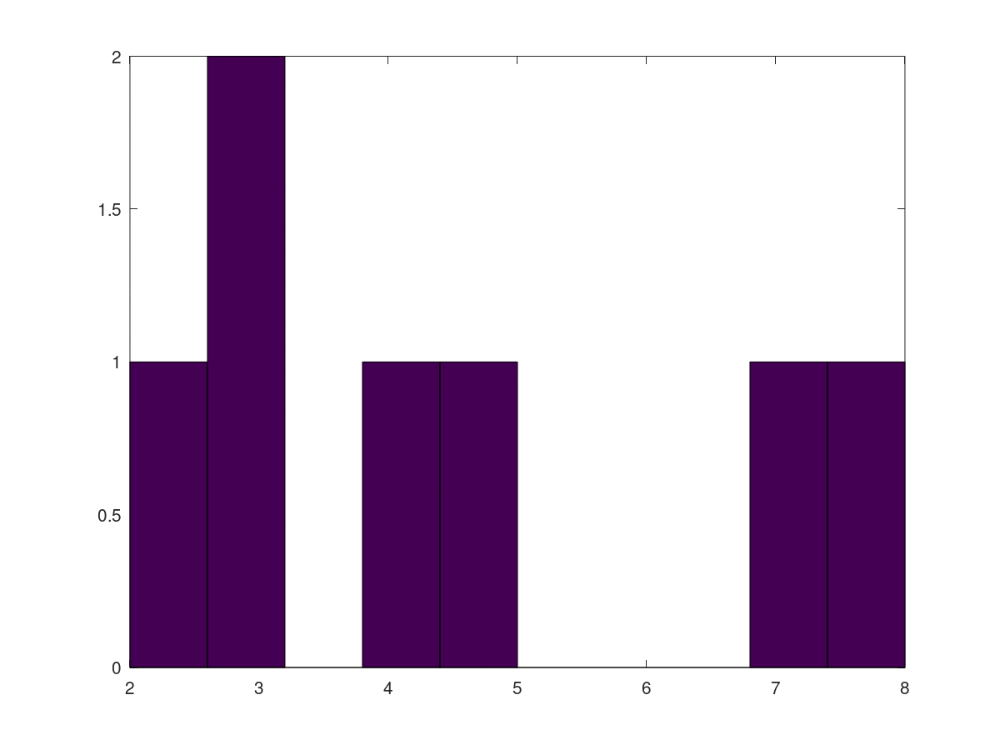
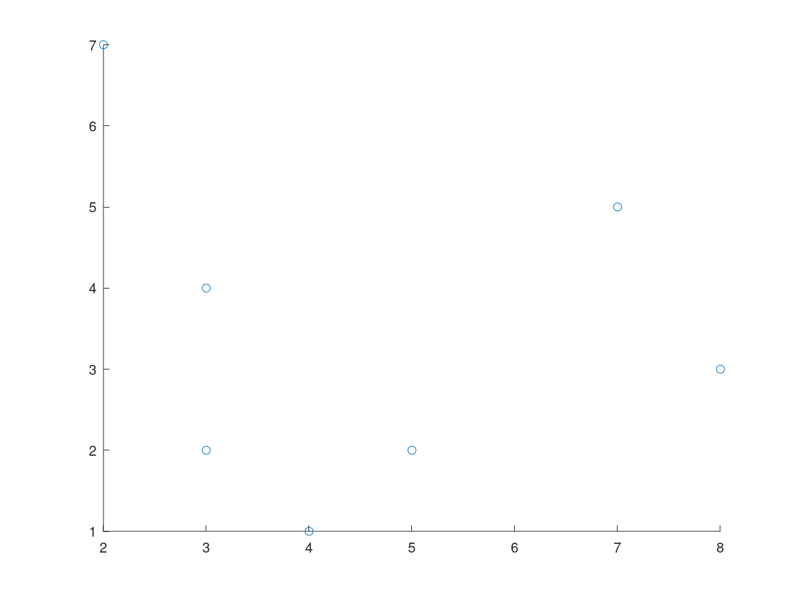

# Resumo OCTAVE
Este documento destina-se a criação de um resumo sobre a linguagem de programação *Octave* para disciplina de cálculo numérico. Irei dispor aqui os algumas características da linguagem e observações úteis, como: Armazenamento, estruturas básicas da linguagem e funções úteis.  

## Armazenamento | Alocação e definição de variáveis

Isso é uma característica importante nas linguagens de programação, pois define como a alocação das variáveis é feita e isso influencia diretamente no desempenho da linguagem. Além disso, essa característica influência diretamente a produtividade da escrita dos códigos e a segurança do código, pois pode facilitar a presença de um comportamento inesperado.

No caso do *Octave*, temos uma linguagem de tipagem dinâmica, ou seja, diferentes tipos de dados podem ser associados a uma mesma variável, isso traz dinamicidade na escrita de códigos e acaba agregando na produtividade na escrita de códigos, pois o programador não precisa explicitamente definir os tipos das variáveis e pode reutilizar uma variável antiga para alocar um novo dado de tipo diferente, porém, isso causa uma instabilidade de tipos e pode trazer um comportamento inesperado para o código quando o tipo do dado é um fator importante.

Em relação a alocação das variáveis, provavelmente, elas são alocadas na heap por conta dessa dinamicidade de tipos e isso acaba criando uma perda de desempenho no que tange o acesso as variáveis.

### **Variáveis**


#### **Funções úteis**  
* `typeinfo()`  -> Retorna uma informação em relação ao tipo da variável.
* `class()`     -> Retorna a classe ao qual o objeto pertence.
* `cast()`      -> Permite a transformação do tipo do valor, caso haja correspondência.
* `isa()`       -> Testa se o a variável é de uma determinada classe 

**Exemplos:**
```octave
    teste = 1                 % ans = 1
   
    typeinfo(teste)           % ans = scalar
    class(teste)              % ans = double

    % Como podemos ver acima todos os valores numéricos são tipados por padrão como double.
    
    teste = 'teste'           % ans = 1
    
    % Aqui vemos que a mesma variável que antes armazenava um double pode armazenar uma string.
    % Isso é o que caracteriza a tipagem dinâmica.
    
    typeinfo(teste)           % ans = sq_string
    class(teste)              % ans = char
    
    % Uma das maneiras de instanciar um tipo especifico é usando o construtor do tipo.
    
    teste = uint16(5)         % ans = 1 

    isa(teste, "uint16")      %ans = 1
    isa(teste, "uint8")       %ans = 0


    teste = cast(5, "uint8")  % ans = 1
    
    typeinfo(teste)           % ans = uint8 scalar
    class(teste)              % ans = uint8

```
### Tipos de dados
Uma característica presente no *Octave* é a variedade de tipos e a possibilidade de escolha da tipagem das variáveis. Isso influencia diretamente a eficiência quanto ao armazenamento e viabiliza uma melhor utilização dos recursos. Pois em determinadas linguagens você não controla isso e em determinadas situações é obrigado a gastar mais recursos de forma desnecessária. Ao conhecer o range de variação de uma determinada variável você pode escolher um tipo mais adequado.

*Alguns exemplos são:* `double`, `single`, `logical`,`char`,`int8`,`int16`,`int32`,`int64`, `uint8`, `uint16`, `uint32`, `uint64` entre outros.

### Operadores Aritméticos
Como a maioria das linguagens o *Octave* permite o uso de operadores aritméticos para a realização de operações matemáticas entre as variáveis.

**Exemplos:**
```octave
x = 5
y = 3

x + y

x - y

x * y

x / y

x \ y

x ** y
```
### Operadores Lógicos
O *Octave* também permite a partir de operadores lógicos os teste entre variáveis.

**Exemplos:**
```octave
x = 5
y = 3

% Operador '==' verifica igualdade entre as variáveis
x == y   % ans = False

% Operador '<' verifica se o primeiro elemento é menor que o segundo
x < y    % ans = False

% Operador '<=' verifica se o primeiro elemento é menor ou igual ao segundo
x <= y   % ans = False

% Operador '>' verifica se o primeiro elemento é maior que o segundo
x > y    % ans = True

% Operador '>=' verifica se o primeiro elemento é maior ou igual ao segundo
x >= y   % ans = True

% Operador '!=' e '~=' verifica se o primeiro elemento é diferente do segundo
x != y   % ans = True
x ~= y   % ans = True

```
### Matrizes 

A definição de matrizes e vetores é semelhante dentro do *Octave*, ambos fazem o uso dos `[]` para definição da estrutura e usam `,` para separação dos elementos em diferentes colunas e `;` para a separação dos elementos entre diferentes linhas.

**Exemplos:**
```octave
% Aqui temos um vetor linha
A = [1, 6, 3]

% Aqui um vetor coluna
a = [1; 6; 3]

% Aqui uma matriz com as dimensões 2x3
A = [1, 6, 3; 2, 7, 4]


% Aqui uma matriz com as dimensões 3x3
A = [1, 6, 3; 2, 7, 4; 5, 6, 7]

```

#### Operadores

O *Octave* da suporte a realização de operações entre matrizes nativamente, tanto operações simples como operações mais complexas como a inversão e a obtenção do determinante de uma matriz.

**Exemplos:**
```octave
A = [1, 2; 3, 4 ] 

B = [2, 2; 2, 2]

% Operações básicas entre matrizes 

A - B    % ans = [-1, 0; 1, 2]

A + B    % ans = [3, 4; 5, 6]

A * B    % ans = [6, 6; 14, 14]

% Operações entre elementos

A ./ B   % ans = [0.50, 1.0; 1.5, 2.0]

A .* B   % ans = [2, 4; 6, 8]

A .^ B   % ans = [1, 4; 9, 16]

% Operações mais complexas

% calculo da inversa

inv(A)   % ans = [-2.0, 1.0; 1.5; -0.5]

% calculo da determinante
det(A)   % ans = -2

```

## Expressões condicionais
Como na maiorias das linguagens o *Octave* contém estruturas que fazem desvios condicionais dentro do código, ou seja, executam ou não determinada parte do código a partir de alguma condição.

**Exemplos:**
```octave
teste = 3

if (teste == 5)
  % O teste condicional será executado 
  %e como teste é igual a 3 o código abaixo não será executado
  
  teste = teste + 3

else
  % Como os teste acima não retornaram true, a expressão abaixo será executada
  teste + 2

endif              % ans = 5

% Além disso, há como colocar mais ifs aninhados a partir do uso do elseif

teste = 3

if (teste == 5)
  teste = teste + 3
elseif (teste == 3)
    teste = teste + 7
else
  teste + 2
endif              % ans = 10

% Outra estrutura condicional é o caso dos switchs
% nesse caso o elemento passado como parametro para o switch 
% é testado para cada um dos casos e caso a condição seja comprida
% a rotina dentro do case é executada

teste = 20

switch (teste)
  case 10
    teste = teste + 30
  case 20
    teste = teste + 5
  otherwise
    teste = teste + 15
endswitch               % ans = 25

```


## Laços de repetição
A partir destas estruturas é possível a repetição de segmentos de códigos em uma quantidade de vezes predeterminada, ou com base em uma condição, ou durante a iteração de um iterável, como: *vetores* e *matrizes*.


**Exemplos:**
```octave
% Para percorrer um range de valores

fib = ones (1, 10);
for i = 3:10
  fib(i) = fib(i-1) + fib(i-2);
endfor

% Aqui um exemplo de um vetor percorrendo um elemento
for i = [1,3;2,4]
  i
endfor

% Outro exemplo é a estrutura while(expressão)
% Ela executa uma sub-rotina enquanto a condição contida na expressão passada por parâmetro for satisfeita

teste = 5
while (teste < 10)
  disp(teste)
  teste = teste + 1
endwhile


```

## Funções
Um dos melhores jeitos de evitar repetição de código é a partir da criação de funções e o *Octave* proporciona estas estruturas. Essas estruturas ao serem chamadas realizam determinadas sub-rotinas que estão associadas a ela. Além disso, podem carregar parâmetros e tornam a execução dessas sub-rotinas algo dinâmico. 

```octave
% Criando uma função

function hello  
  disp('Hello');
endfunction

% Parametrizando uma função

function hello(name)
  disp(['Hello ', name];
endfunction

% Definindo o retorno da função

function str = hello(name)
  str = strcat('Hello ', name);
endfunction

```

## I/O - Terminal

Uma coisa que pode ser necessária durante o uso da linguagem é o apresentação de conteúdo no terminal e entrada de informação via terminal.

**Examples:**
```octave
% Para imprimir uma string na tela
disp('Hello World')

% Para imprimir uma string e parametrizar ela
number = 5
printf ("O número é %d\n", number);

% Para pedir uma entrada via terminal
teste = input ("Introduza um número: ")
```
## Plotting
**Funções úteis:**
* `available_graphics_toolkits()`
* `graphics_toolkit()`

**Exemplos:**

```octave
% Essa função retorna as engines disponíveis para a criação dos gráficos

available_graphics_toolkits()   
% ans ={
%   [1,1] = fltk
%   [1,2] = gnuplot
%   [1,3] = qt } 

% Aqui você pode trocar entre as engines
graphics_toolkit("fltk")

```

**Exemplo de gráficos:**
**Histograma**
```
teste = [2 5 3 4 7 8 3]
hist(teste)
```


**Gráfico de dispersão**

```
x = [2 5 3 4 7 8 3]
y = [7 2 4 1 5 3 2]
scatter(x, y)
```

